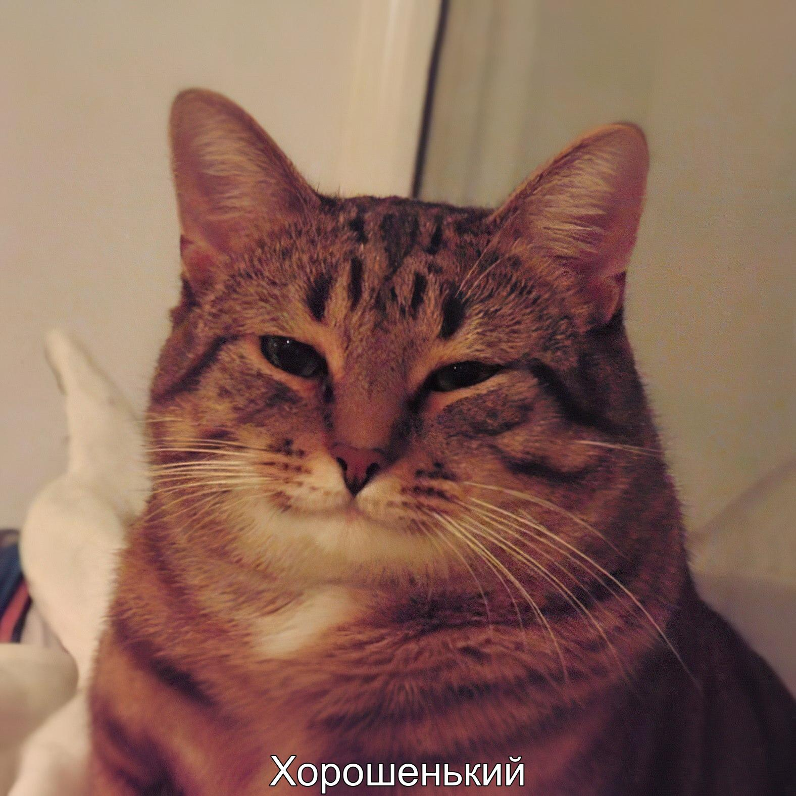

# 🖼️ Мем-генератор на Python

Автоматическое создание мемов с кастомным текстом и обводкой. Поддерживает настройку шрифтов, цветов и позиций текста.

  
*Пример результата*

---

## Оглавление 📋
1. [Возможности](#возможности)  
2. [Установка](#установка)  
3. [Использование](#использование)  
4. [Доступные параметры](#доступные-параметры)  
5. [Примеры](#примеры)  
6. [Требования](#требования)  
7. [Troubleshooting](#troubleshooting)  
8. [Автор](#автор)

---

## Возможности <a name="возможности"></a>
- ✔️ Настройка текста  
- ✔️ Выбор шрифтов  
- ✔️ Цвета и обводка текста  
- ✔️ Позиционирование (верх/центр/низ)  
- ✔️ Командная строка для автоматизации  

---

## Установка <a name="установка"></a>

```bash
git clone https://github.com/AntonSinica/Meme_Generator.git
cd Meme_Generator
pip install -r requirements.txt  # Содержит Pillow
```

---

## Использование <a name="использование"></a>

```bash
python meme_generator.py --image input.jpg --text "Текст мема" --output result.jpg [дополнительные параметры]
```

### Доступные параметры: <a name="доступные-параметры"></a>
| Параметр          | По умолчанию | Описание                          |
|-------------------|--------------|-----------------------------------|
| `--font`          | `arial.ttf`  | Путь к шрифту TTF                 |
| `--font_size`     | `40`         | Размер текста                     |
| `--color`         | `white`      | Цвет текста (название/HEX)        |
| `--position`      | `bottom`     | Позиция: `top`/`center`/`bottom` |
| `--stroke-width`  | `0`          | Ширина обводки (0 - выключено)    |
| `--stroke-color`  | `black`      | Цвет обводки (по умолчанию чёрный)|

---

### Примеры: <a name="примеры"></a>
```bash
# Стандартный мем
python main.py --image img.jpg --text "Текст в низу" --output out.jpg

# Мем с обводкой
python main.py --image img.jpg --text "ВАЖНЫЙ ТЕКСТ" --stroke-width 3 --stroke-color red --color yellow

# Свой шрифт
python main.py --image img.jpg --text "Привет!" --font /fonts/arial.ttf --position center
```

---

## Требования <a name="требования"></a>
- Python 3.6+
- Библиотека `Pillow` (установлена через `requirements.txt`)

---

## Troubleshooting <a name="troubleshooting"></a>
- **"Шрифт не найден"** → проверьте путь к файлу `.ttf`  
- **"Цвет не работает"** → используйте HEX (например, `#FF0000`) или стандартные названия  
- **"Текст за границами изображения"** → уменьшите размер шрифта или используйте позицию `center`

---

## Автор <a name="автор"></a>
[Антон Баранов](https://github.com/AntonSinica)